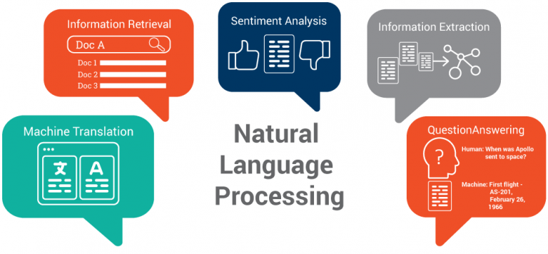

# Processamento de Linguagem Natural (PLN) e suas aplicações

O Processamento de Linguagem Natural (PLN), comumente abreviado como PLN, é um campo da Inteligência Artificial (IA) dedicado à interação entre computadores e seres humanos através da linguagem natural. Seu objetivo final é ler, decifrar, compreender e até prever linguagens humanas de forma significativa. A maioria das técnicas de PLN baseia-se em aprendizado de máquina para extrair significado das linguagens humanas.

  

Neste repositório, apresentamos uma série de notebooks que exploram o processamento de linguagem natural (PLN) e suas aplicações.

No primeiro notebook, abordamos técnicas básicas e avançadas, incluindo boas práticas para a manipulação de texto em Python.

Em seguida, oferecemos uma introdução ao processamento de linguagem natural utilizando diversos pacotes e métodos especializados para essa finalidade.

Além disso, apresentamos frameworks como o PyTorch, que aplica operações matemáticas a tensores para treinar modelos de Deep Learning. Este notebook fornece uma introdução ao uso de tensores e sua importância nos processos de deep learning.

Exploramos também modelos de Classificação de Idiomas de Sentenças com Bag of Words, Técnicas de TF-IDF para Identificação de Palavras Relevantes, bem como métodos Word2Vec e Seq2Seq. Por fim, incluímos um estudo de caso com Inteligência Artificial para Previsão de Sentenças em Embargos de Declaração e um Buscador de Palavras em Texto por Similaridade, utilizando o modelo GloVe, uma técnica de vetorização de palavras.

  

Em suma, este repositório serve como uma fonte de referência abrangente para explorar as principais etapas, pacotes, métodos, aplicações e abordagens relacionados ao processamento de linguagem natural. Ressaltando que todo o conteúdo é um compilado de materiais disponíveis no curso de Machine Learning da **[Data Science Academy](https://www.datascienceacademy.com.br/)**.
